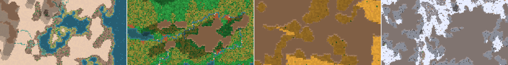
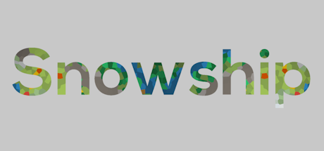

<h1 align="center">Hej, I'm Ryan</h1>
<h3 align="center">Stockholm-based game developer specialised in Unity and UI-development.</h3>

<h3>Current Projects</h3>

- 🏔️ I'm working on [**Snowship**](https://github.com/rythwh/snowship), a procedurally-generated colony-survival game built in Unity.
- 🧰 I've lately been building in-editor Unity tools for e.g. streamlining UI development and editing JSON data.
- 🧠 I'm learning more about data-oriented design and applying it to Snowship.

<h3>Games I've Worked On</h3>

  
  
  
  

<h3>Connect</h3>

